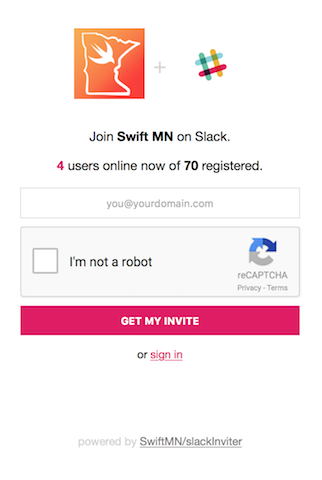

# SwiftMN Slack Inviter

## About SwiftMN

SwiftMN is a Swift user group in Minneapolis, Minnesota.  
You can meet us in person and join our meetup at [swift.mn](http://swift.mn)  
You can talk to us on Slack at [slack.swift.mn](http://slack.swift.mn)  
You can email us directly at [info@swift.mn](mailto:info@swift.mn)  

You can also contribute to this project! Pull requests, issues, feature requests, and feedback of any kind are all welcome.

## About Slack Inviter

### Features

* Automatically send invitations so you don't have to manage invites yourself
* Provides a nice sign up form for your slack team
  * Your team's icon will be used on the form automatically
  * Displays the number of active users as well as the number of registered users
  * Spam and abuse protection with [reCAPTCHA](https://www.google.com/recaptcha/intro/)

Here's an example of what it looks like. This is the invite form for [SwiftMN](slack.swift.mn)  

### Roadmap

* Badges that show avtive users in realtime 

## Getting Started

There are several steps to make this work, but luckily they are all really simple. Just relax, do every step, and we'll get through this together 😉

### Fork this repo

👆 Just press that button at the top of this screen.  
From this point on, you can follow these steps from your own fork. This is now your code, hooray! 🎉

### Install Vapor

This is the worst part of the whole process. It's a lot of downloading and waiting.

Here is the [full documentation](https://docs.vapor.codes/2.0/getting-started/install-on-macos/) for reference.

Basically, it just says to:  

* Download Xcode from the Mac App Store
* Open Xcode so it finishes installation
* Verify that the installation worked by opening Terminal and running this command:  

        eval "$(curl -sL check.vapor.sh)"

* Install [Homebrew](https://brew.sh) if you don't already have it installed:  

        /usr/bin/ruby -e "$(curl -fsSL https://raw.githubusercontent.com/Homebrew/install/master/install)"
    
* Add the Vapor tap to homebrew:      
    
        brew tap vapor/homebrew-tap
        brew update

* Install Vapor:  

        brew install vapor

Phew! that was a lot of waiting. Now let's get into the fun parts.

### Set up reCAPTCHA

* Fill out [this form](https://www.google.com/recaptcha/admin#list)
* Select the option `reCAPTCHA V2, Validate users with the "I'm not a robot" checkbox.`
* add `vapor.cloud` to your list of Domains
  * You might not need to do this if you're setting up your own custom domain
* Fill out the rest of the form and hit the `Register` button
* In the `Adding reCAPTCHA to your site` section, grab your `Site key` and your `Secret key`
  * You'll need these in a little bit. Don't get them mixed up, and keep them secret

### Generate a Slack API token

In order for the app to send invites on your behalf, you need to get a token from Slack. The invites that are sent will come from whatever account you use to generate this token so I recommend creating a new user and naming it something like `slackinviter`. Your new slackinviter account must be an admin so if you're not an admin, find someone who is and make slackinviter an admin.

* follow [this link](https://api.slack.com/custom-integrations/legacy-tokens) and hit the `Create token` button.
* copy the token
  * You'll need this in a little bit. Keep this token a secret.

### Set up Vapor Cloud

Checkout the [full documentation](https://docs.vapor.cloud/quick-start/) for more details

### Update Configs

You'll need 4 things for this step

* reCAPTCHA site key
* reCAPTCHA secret key
* Slack API token
* Your Slack workspace name
  * This is whatever your subdomain is, or whatever you put into the first part of [the sign in form](https://slack.com/signin)
  * For example, I log in to [swiftmn.slack.com](https://swiftmn.slack.com) so mine is `"swiftmn"`

Now that you've gathered those, we need to tell vapor cloud about them. In terminal, run these commands and follow the prompts to make sure you set them on the right project, etc.

* make sure you change `your-workspace-url`  
*     vapor cloud config modify SLACK_WORKSPACE=your-workspace-url
* make sure you change `your-slack-token`  
*     vapor cloud config modify SLACK_TOKEN=your-slack-token
* make sure you change `your-recaptcha-sitekey`  
*     vapor cloud config modify RECAPTCHA_SITEKEY=your-recaptcha-sitekey
* make sure you change `your-recaptcha-secret`  
*     vapor cloud config modify RECAPTCHA_SECRET=your-recaptcha-secret

Just to make sure we did that correctly, verify your config settings by running

    vapor cloud config dump

### Deploy

We're in the home stretch now. Simply run this command and follow the prompts:

    vapor cloud deploy

* You don't need a database
* I use `incremental` builds unless I need a clean build for some reason

### Share your url and be social!

Send `your-slug.vapor.cloud` to anyone and everyone! Post it on your website, twitter, and all the things! Relax knowing that you never have to deal with managing invitations again.
